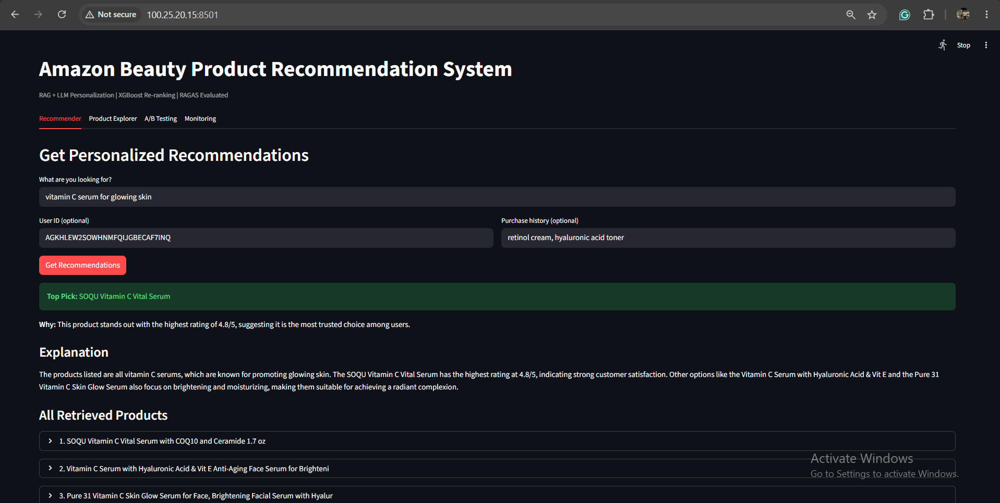
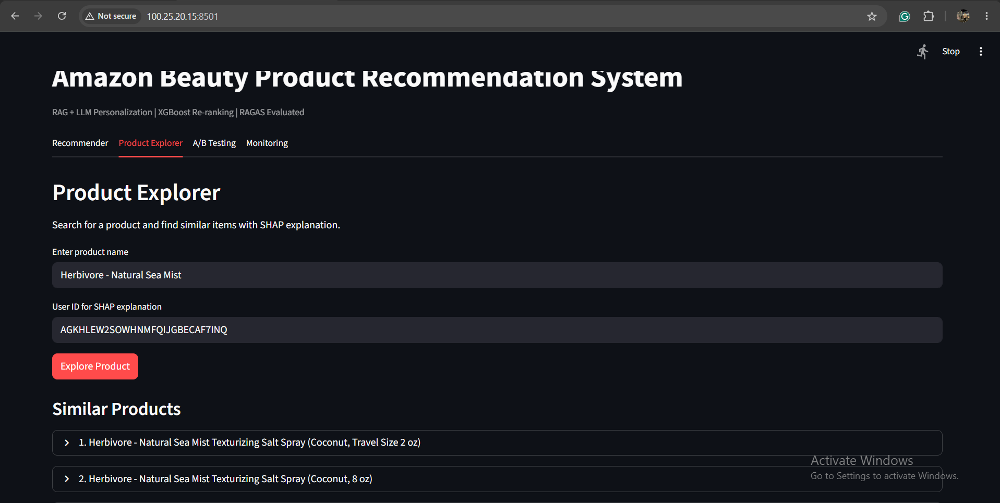
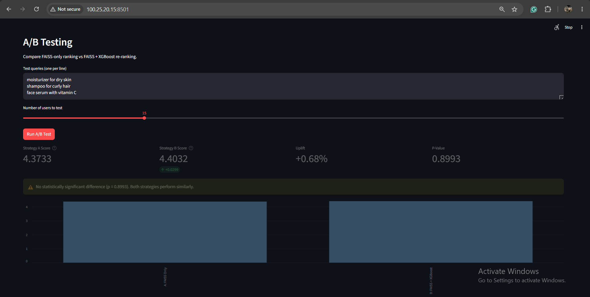
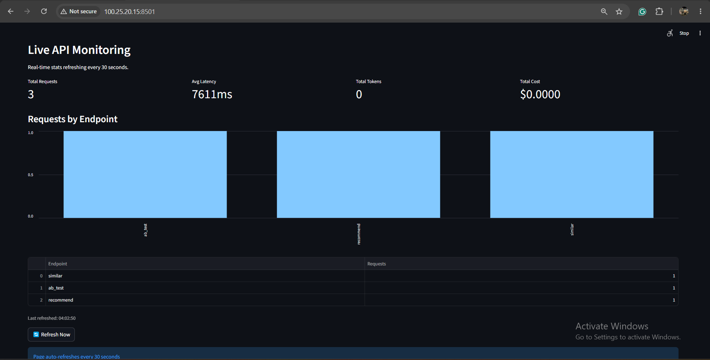
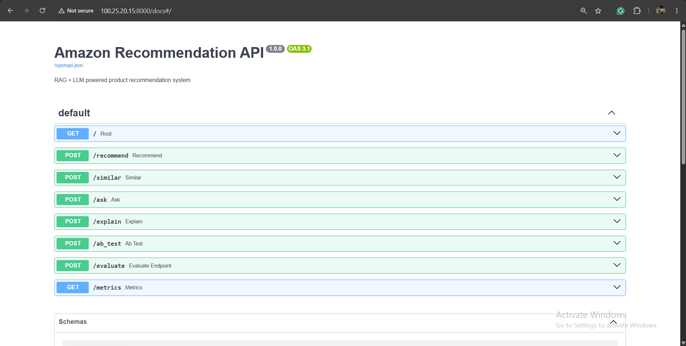

# Amazon Beauty Product Recommendation System
### RAG + LLM Personalization | XGBoost Re-ranking | RAGAS Evaluated | AWS Deployed


## 📌 Project Overview
End-to-end Amazon-style recommendation system built on 700k+ real beauty product reviews.
Combines semantic search (FAISS), ML ranking (XGBoost), and LLM personalization (GPT-4o-mini)
into a production-ready RAG pipeline — deployed on AWS ECS Fargate with GitHub Actions CI/CD.

## 🎥 Demo
[Watch 60-second demo](https://www.loom.com/share/0f59f1e019c24a15a7bdc39db8a32dbe)

## 📸 Screenshots

**Tab 1 — Recommender**


<br><br>

**Tab 2 — Product Explorer + SHAP**


<br><br>

**Tab 3 — A/B Testing**


<br><br>

**Tab 4 — Live Monitoring**


<br><br>

**API Swagger Docs**



## 📊 Key Metrics

| Metric | Score |
|--------|-------|
| RAGAS Faithfulness | 0.45 |
| RAGAS Answer Relevancy | 0.90  |
| RAGAS Context Recall | 0.80  |
| XGBoost RMSE | 0.5647 |
| FAISS Index Size | 50,000 products |
| A/B Test P-Value | 0.83 (documented) |
| Total Dataset | 700k+ reviews, 112k products |

## 🏗️ System Architecture
User Query
↓
FAISS Semantic Search (OpenAI text-embedding-3-small, 50k products)
↓
XGBoost Re-ranking (predicted rating per user-product pair)
↓
GPT-4o-mini LLM Explanation (citation-grounded, Pydantic validated)
↓
FastAPI REST API (7 endpoints) → Streamlit UI (4 tabs)
↓
Docker → AWS ECR → AWS ECS Fargate → GitHub Actions CI/CD

## 🛠️ Tech Stack

| Category | Tools |
|----------|-------|
| Dataset | Amazon Reviews 2023 (McAuley Lab, 700k+ reviews) |
| ML Models | XGBoost, ALS (implicit) |
| Embeddings | OpenAI text-embedding-3-small, HuggingFace all-MiniLM-L6-v2 |
| Vector Search | FAISS (Meta) — dual index comparison |
| RAG | LangChain, OpenAI GPT-4o-mini, Pydantic v2 |
| RAG Evaluation | RAGAS (faithfulness, relevancy, context recall) |
| Explainability | SHAP (TreeExplainer, summary + waterfall plots) |
| Experiment Tracking | MLflow |
| Backend | FastAPI, Pydantic v2, uvicorn |
| Frontend | Streamlit (4-tab dashboard) |
| Containerization | Docker, docker-compose |
| Cloud | AWS ECS Fargate, AWS ECR |
| CI/CD | GitHub Actions |

## 🔌 API Endpoints

| Method | Endpoint | Description |
|--------|----------|-------------|
| POST | `/recommend` | RAG pipeline → ranked products + LLM explanation |
| POST | `/similar` | FAISS semantic search → similar products |
| POST | `/ask` | Citation-grounded Q&A → answer with source attribution |
| POST | `/explain` | SHAP values → why XGBoost scored this product |
| POST | `/ab_test` | FAISS vs FAISS+XGBoost → uplift + p-value |
| POST | `/evaluate` | Real-time RAGAS scoring on any query |
| GET | `/metrics` | Live API stats → latency, requests by endpoint |

## 📁 Project Structure
```
amazon-recommendation/
├── notebooks/                 # Weeks 1-4 (EDA, models, embeddings, RAG)
│   ├── 01_eda.ipynb
│   ├── 02_model.ipynb
│   ├── 03_embeddings.ipynb
│   └── 04_rag_pipeline.ipynb
├── rag/                       # Production RAG pipeline
│   ├── evaluator.py           # RAG pipeline + RAGAS evaluation
│   └── explainer.py           # SHAP explainability
├── backend/                   # FastAPI REST API
│   ├── main.py                # 7 endpoints
│   ├── models.py              # Pydantic schemas
│   └── monitoring.py          # In-memory request tracking
├── frontend/                  # Streamlit UI
│   └── app.py                 # 4-tab dashboard
├── monitoring/                # Experiment artifacts
│   ├── embedding_comparison_results.csv   # OpenAI vs HuggingFace comparison
│   └── rating_correlation_plot.png        # Semantic similarity vs rating correlation
├── ml/                        # Saved models
├── data/                      # Processed datasets
├── .github/workflows/         # GitHub Actions CI/CD
└── docker-compose.yml
```

## ⚙️ Local Setup

```bash
# 1. Clone repo
git clone https://github.com/Ronakpatel36186/Amazon-Product-Recommendation-Rag.git
cd Amazon-Product-Recommendation-Rag

# 2. Install dependencies
pip install -r requirements.txt

# 3. Add OpenAI API key
echo "OPENAI_API_KEY=your-key-here" > .env

# 4. Run API (terminal 1)
uvicorn backend.main:app --reload

# 5. Run UI (terminal 2)
streamlit run frontend/app.py
```

> **Note:** Large data files (CSVs, FAISS indexes, model files) are not included in the repo.
> Run notebooks 01-04 in order to regenerate them from the Amazon Reviews 2023 dataset.

## 🐳 Docker Setup

```bash
# Run both containers
docker-compose up --build

# API: http://localhost:8000/docs
# UI:  http://localhost:8501
```

## ☁️ AWS Deployment

Deployed on AWS ECS Fargate with GitHub Actions CI/CD.
Every `git push` to `main` automatically rebuilds and redeploys both containers.

```bash
# Start
aws ecs update-service --cluster amazon-recommendation-cluster \
  --service amazon-recommendation-service --desired-count 1 --region us-east-1

# Stop (save cost)
aws ecs update-service --cluster amazon-recommendation-cluster \
  --service amazon-recommendation-service --desired-count 0 --region us-east-1
```

## 📝 Resume Bullet

Built end-to-end Amazon-style recommendation system — XGBoost + ALS ranking (RMSE: 0.5647),
dual FAISS retrieval (OpenAI + HuggingFace sentence-transformers, 50k products),
RAG pipeline with LLM personalization (RAGAS answer relevancy: 0.90, context recall: 0.80),
citation-grounded Q&A, SHAP explainability, A/B testing with scipy, real-time monitoring,
deployed on AWS ECS Fargate via GitHub Actions CI/CD.

## 📚 Dataset
[Amazon Reviews 2023](https://huggingface.co/datasets/McAuley-Lab/Amazon-Reviews-2023)
by McAuley Lab, UC San Diego — 338M real Amazon reviews. Used All_Beauty subset.

## ⚠️ Cost Note
Total project API cost: ~$8-12.
AWS ECS Fargate: ~$0.10-0.15/hour — start on demand, stop after demos.